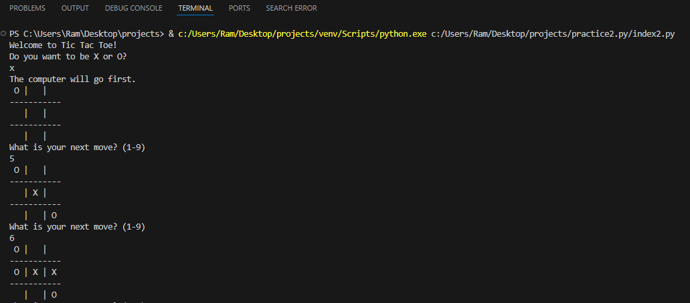
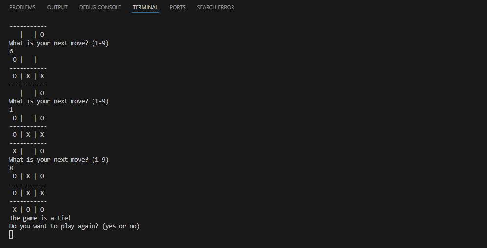

<h1>
  TIc-Tac-Toe
</h1>
<h3>
  Summary 
</h3>

  Tic-Tac-Toe, also known as Noughts and Crosses, is a classic two-player game often used as a beginner's Python project to strengthen programming skills. It involves a 3x3 grid where players alternately mark X or O in an empty cell, aiming to align three of their symbols horizontally, vertically, or diagonally. Python implementation of Tic-Tac-Toe typically uses lists to represent the grid, loops to manage turns, and conditions to check for a winner or a draw. The program includes user input validation to prevent overwriting occupied cells, ensuring a smooth gaming experience.

Players can interact with the program via the console, inputting their desired row and column indices to place their symbol. The code checks after each turn if there’s a winning condition or if the grid is full, ending the game accordingly. This project enhances understanding of Python basics, including loops, conditional statements, and functions. Advanced versions may involve AI to play against a computer or graphical interfaces for better user engagement.

<h3>
  The output is like :-
</h3>

